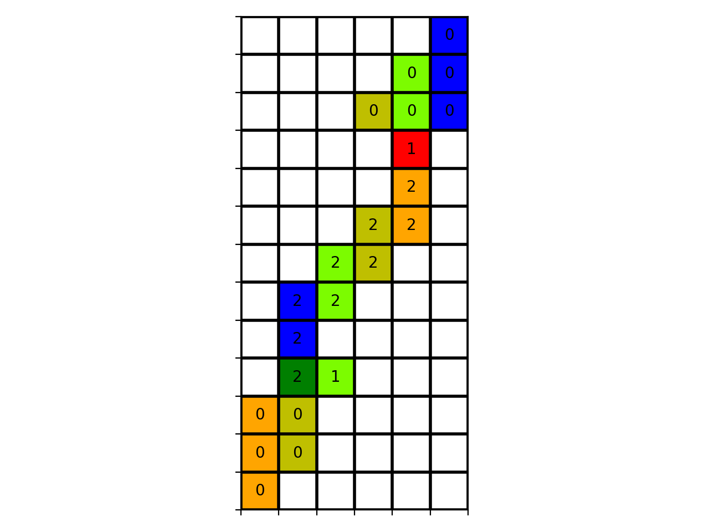
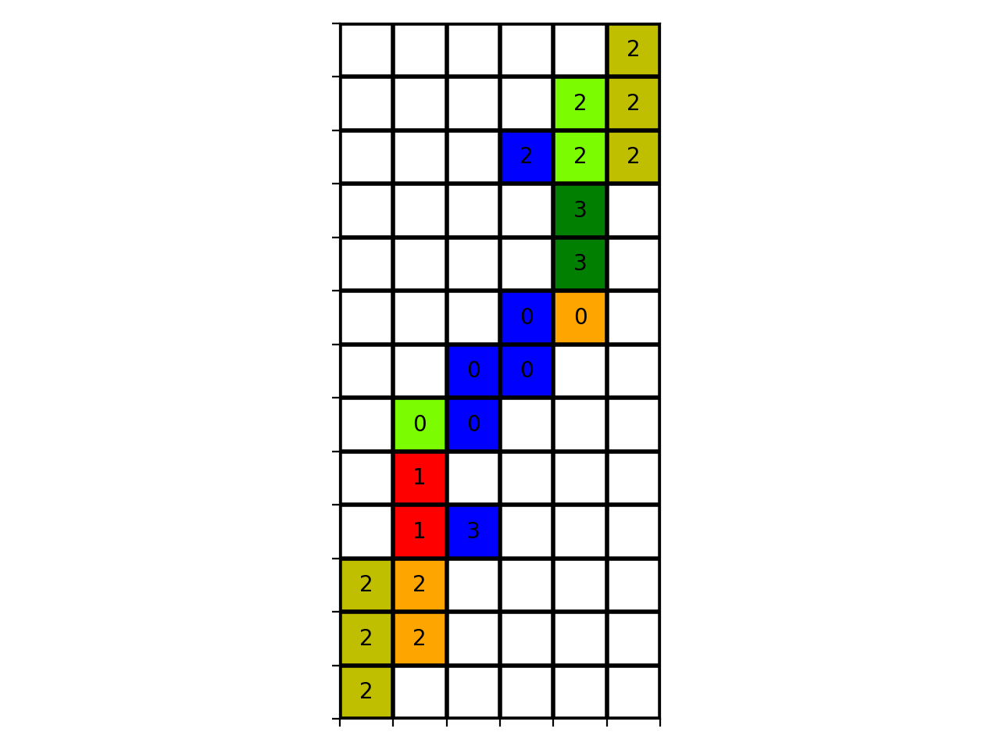

# Unfolding Boxes with Local Constraints: CADE 30

This repository contains the implementation of the encoding for box unfoldings associated to the CADE-30 submission *"Unfolding Boxes with Local Constraints"*, by Long Qian, Eric Wang, Bernardo Subercaseaux, and Marijn Heule.

<!-- Unfolding orthogonal boxes through SAT. The folder encoder contains the 
encoding/decoder scripts. The experiments folder contains scripts used to 
generate all sub-problems for enumerating solutions. -->

## Requirements

Our code requires the Python library [PySAT](https://pysathq.github.io/), which can be installed using
```
pip install python-sat
```
For visualizing solutions, the [maptlotlib](https://matplotlib.org/) library is required, and can be installed using
```
pip install matplotlib
```
In terms of solver, this README uses [kissat](https://github.com/arminbiere/kissat/) as an example. For the enumeration of solutions, we use [allsat](https://github.com/jreeves3/allsat-cadical).

## Basic Usage
### Encoder
To find a common unfolding between boxes of dimensions $(a, b, c), (u, v, w)$ run:
```
python3 encoding/encoder.py -d a b c u v w
```
As a result, the file `common_unfolding.cnf` will be generated.

For example, if we run
```
python3 encoding/encoder.py -d 1 1 5 1 2 3
kissat common_unfolding.cnf > solution.txt
```
A solution is obtained in about 1 second. To decode the solution, run
```
python3 encoding/decoder.py -d 1 1 5 1 2 3 -i solution.txt -s
```
As a result, one gets two images:

<p>
  
&nbsp; &nbsp; &nbsp; &nbsp;
  
</p>
and a textual representation is left in the console:

```
*****2
****52
***352
****0*
****4*
***34*
**53**
*25***
*2****
*15***
43****
43****
4*****

*****3
****53
***253
****1*
****1*
***24*
**22**
*52***
*0****
*02***
34****
34****
3*****
```
We take the following convention for enumerating the faces:
```
0 -> Bottom face
1 -> Top face
2 -> Front face
3 -> Back face
4 -> Left face
5 -> Right face
```
<!-- 
### Decoder 
If sol.cnf is the v-lines output of the encoder file + first line saying satisfiable,
the solution can be decoded by:
```
python3 decoder.py -d a b c u v w -i sol.cnf 
```
where the option `-v 1` can be added to additionally show the edges preserved. -->

## Enumerating all solutions
To generate all sub-problems for enumerating unfoldings between boxes of dimensions $(a, b, c), (u, v, w)$ do:

```
python3 experiment_set_up.py -enc ../encoder/encoder.py -pair ../encoder/find_iso_pairs.py -d a b c u v w --orient2=5 -o .
```
If (a, b, c) is of the form (1, 1, n), use `--orient2=0` instead. 